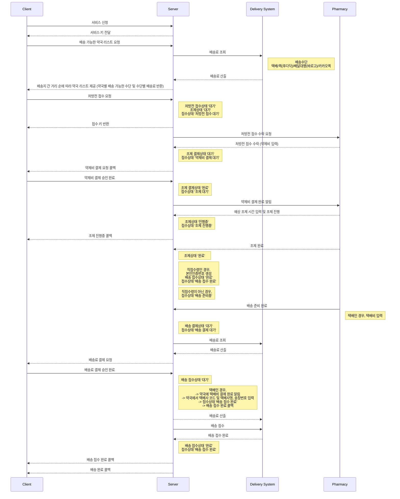

```mermaid
sequenceDiagram
Client ->> Server: 서비스 신청
Server -->> Client: 서비스 키 전달
Client ->> Server: 배송 가능한 약국 리스트 요청
Server ->> Delivery System: 배송료 조회
Note right of Delivery System: 배송수단<br/>택배/퀵(후다닥)/배달대행(바로고)/카카오퀵
Delivery System -->> Server: 배송료 산출
Server -->> Client: 배송지 간 거리 순에 따라 약국 리스트 제공 (약국별 배송 가능한 수단 및 수단별 배송료 반환)
Client ->> Server: 처방전 접수 요청
Note right of Server: 처방전 접수상태 '대기'<br/>조제상태 '대기'<br/>접수상태 '처방전 접수 대기'
Server -->> Client: 접수 키 반환
Server ->> Pharmacy: 처방전 접수 수락 요청
Pharmacy -->> Server: 처방전 접수 수락 (약제비 입력)
Note right of Server: 조제 결제상태 '대기'<br/>접수상태 '약제비 결제 대기'
Server -->> Client: 약제비 결제 요청 콜백
Client ->> Server: 약제비 결제 승인 완료
Note right of Server: 조제 결제상태 '완료'<br/>접수상태 '조제 대기'
Server ->> Pharmacy: 약제비 결제 완료 알림
Pharmacy -->> Server: 예상 조제 시간 입력 및 조제 진행
Note right of Server: 조제상태 '진행중'<br/>접수상태 '조제 진행중'
Server -->> Client: 조제 진행중 콜백
Pharmacy -->> Server: 조제 완료
Note right of Server: 조제상태 '완료'
Note right of Server: <br/>직접수령인 경우,<br/>본인인증번호 생성<br/>배송 접수상태 '완료'<br/>접수상태 '배송 접수 완료'
Note right of Server: 직접수령이 아닌 경우,<br/>접수상태 '배송 준비중'
Pharmacy ->> Server: 배송 준비 완료
Note right of Pharmacy: 택배인 경우, 택배비 입력
Note right of Server: 배송 결제상태 '대기'<br/>접수상태 '배송 결제 대기'
Server ->> Delivery System: 배송료 조회
Delivery System -->> Server: 배송료 산출
Server -->> Client: 배송료 결제 요청
Client ->> Server: 배송료 결제 승인 완료
Note right of Server: 배송 접수상태 '대기'
Note right of Server: 택배인 경우,<br/>-> 약국에 택배비 결제 완료 알림<br/>-> 약국에서 택배사 코드 및 택배사명, 송장번호 입력<br/>-> 접수상태 '배송 접수 완료'<br/>-> 배송 접수 완료 콜백
Server -->> Delivery System: 배송료 산출
Server ->> Delivery System: 배송 접수
Delivery System -->> Server: 배송 접수 완료
Note right of Server: 배송 접수상태 '완료'<br/>접수상태 '배송 접수 완료'
Server -->> Client: 배송 접수 완료 콜백
Server -->> Client: 배송 완료 콜백
```