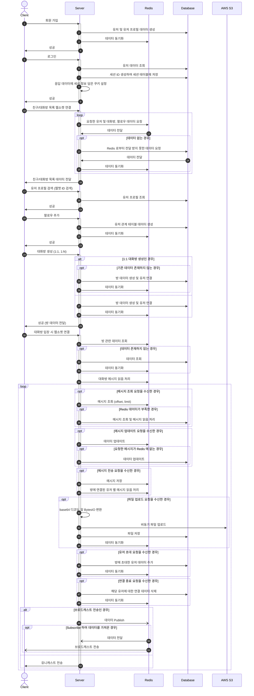
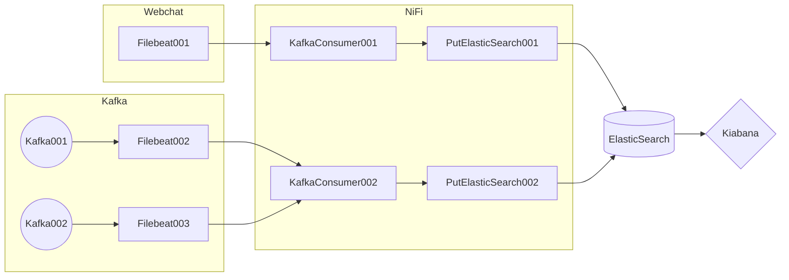

# 웹챗 (WebChat)
### 유저들 간 실시간 채팅을 할 수 있는 서비스

## Prerequisites
> 언어
- Python 3.10.4

> 웹 프레임워크
- FastAPI 0.87.0

> 데이터베이스
- MySQL 8.0.32

## AWS EC2 Deployment
- nginx.conf 파일 추가 (path: websocket / client / nginx.conf)
```
    ...
    upstream backend_app {
       server backend-container:8000;
    }
    
    server {
        listen       80;
        listen       [::]:80;
        server_name  _;
        root         /usr/share/nginx/html;
        index        index.html;
    
        error_page 404 /404.html;
        location = /404.html {
        }
    
        error_page 500 502 503 504 /50x.html;
        location = /50x.html {
        }
    
        location / {
            root /usr/share/nginx/html;
            try_files $uri $uri/ /index.html;
        }
    
        location /api {
            proxy_pass http://backend_app;
            proxy_set_header Host $http_host;
            proxy_set_header X-Real-IP $remote_addr;
            proxy_set_header X-Forwarded-For $proxy_add_x_forwarded_for;
            proxy_set_header X-Forwarded-Proto $scheme;
            proxy_set_header X-NginX-Proxy true;
            proxy_set_header Upgrade $http_upgrade;
            proxy_set_header Connection "upgrade";
            proxy_http_version 1.1;
    
            proxy_pass_header Set-Cookie;
            proxy_pass_header X-CSRFToken;
            proxy_redirect off;
            proxy_buffering off;
        }
        location /docs {
            proxy_pass http://backend_app;
        }
        location /openapi.json {
            proxy_pass http://backend_app;
        }
    }
}
```
- .env 파일 추가 (path: websocket / server / .env)
```dotenv
DB_NAME="websocket"
DB_USERNAME=""
DB_PASSWORD=""
DB_HOST=""
DB_PORT=3306

BACKEND_CORS_ORIGINS=[""]

DEBUG=false

SESSION_SECRET_KEY=""

REDIS_ENDPOINT=[""]
REDIS_DATABASE=0

AWS_ACCESS_KEY=""
AWS_SECRET_ACCESS_KEY=""
AWS_STORAGE_BUCKET_NAME=""
AWS_CDN_URL=""
```

- 도커 이미지 빌드 및 컨테이너 실행
```shell
$ docker-compose up --build -d
```

## Flow


## Infra
- Webchat EC2 1대 (Filebeat 설치)
- Kafka EC2 2대 (Filebeat 설치)
- Zookeeper EC2 3대
- NiFi & ElasticSearch & Kibana EC2 1대
- 로그 모니터링 환경 구성


## Production
- IP address: http://13.125.196.205/